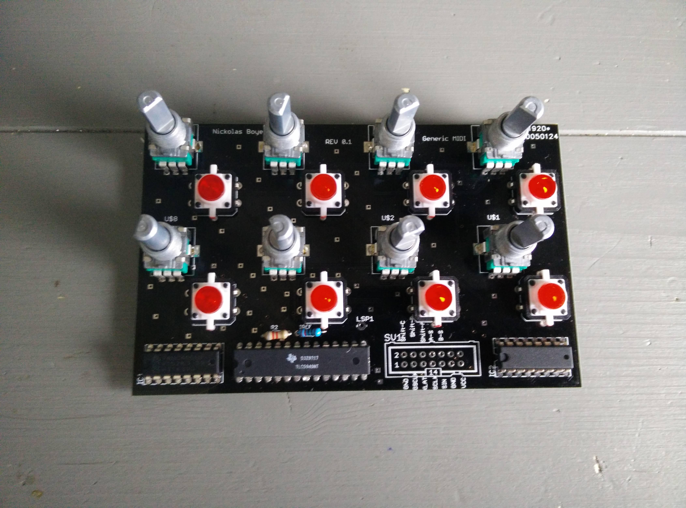

# The "Generic MIDI controller"

*Diclaimer: I published this on a forum I joined at the age of 15 so some of the writing may be a little less than perfect but I decided not to edit anything when moving this to my own blog from the [DJTT forum](https://forum.djtechtools.com) on 3-11-19.*

I've been researching DIY midi controllers for as long as I am a member of DJTT. However it has always been difficult for me to settle on a design that really suits my needs instead of a quick project that I do not actually need. One thing I notice a LOT is that I would like to have a dedicated controller for my effects that enables me to control all of them without the need for shift buttons or weird button placement. I think this design is the solution for me. This controller is going to be placed behind a standard 12" mixer.

## Design

First of all I would like to thank DJTT for the design pack for the "Midi Fighter X contest" that helped me create this.
Here it is:

## Schedule

- 25-07-15 Order all parts (buttons, pot's, teensy)
- 10-08-15 Complete design in auto cad for lasercutter
- 15-08-15 Finish and order PCB
- 25-08-15 Cast buttons in custom mold. 
- 01-09-15 Send files to lasercutter (and possibly 3d printer)
- 20-09-15 Finalize software design

## Technical details

Brain: [Teensy 3.1](https://www.pjrc.com/teensy/)
Material case: Three layers of 2mm acrylic

## Build log

### 28/8 
Ordered all parts except for the arcadebuttons (they are out of stock) just started on the first PCB design and have just finished the top layer of acrylic:29/8

### 29/8 
Ordered the fist PCB: (professionals be like 🤨 when they see this)

### 30/8 
Made a concept for the 3d-printed case, final design is going to be made in autoCAD:

*Finished the design in autoCAD but upon requesting a quote it appeared to cost $276.83 so I'm going with bent acrylic*

### 31/8 
Ordered the Chroma Caps:

### 12/9 
Received the lasercut parts: (final device is going to be grey with red):

### 09/16
Got the PCB's in the mail, going to check them later but they look OK. 

### 09/17
Got the buttons from focus attack for......... here it comes...... $7 a piece! wow! this sucks

This however does not:

### 09/19
Assembled the button PCB's and tested them:

### 10/02
Finished the PCB for the potentiometers.

### 10/25
Assembled the PCB for the Pot's:

### 11/7
Finally found a place that sold transparant plastic (acrylic) rods with a small diameter in small quantity's, had to enlarge the holes though (with a drill bit 0.5 mm a time * 80 times) then i had to saw this rod in tiny matching pieces (saw, sand the end of the rod and saw the next piece using a saw box). Then I used superglue to glue these on, on the first two i used too much so I had to remove these buttons.

### 11/14
Finished smaller buttons:

### 20/01
Shitty pic's are better than no pic's😁, progress is slow especially since I'm in the middle of moving to Leiden.

